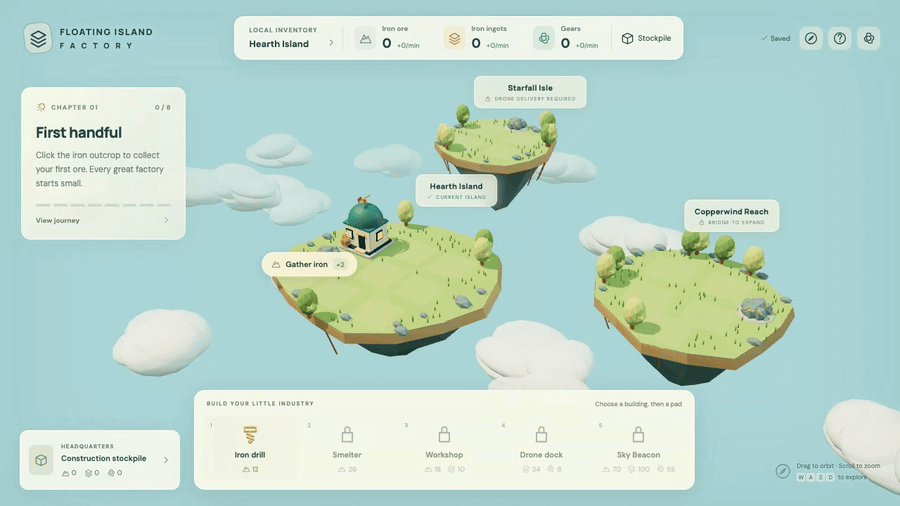
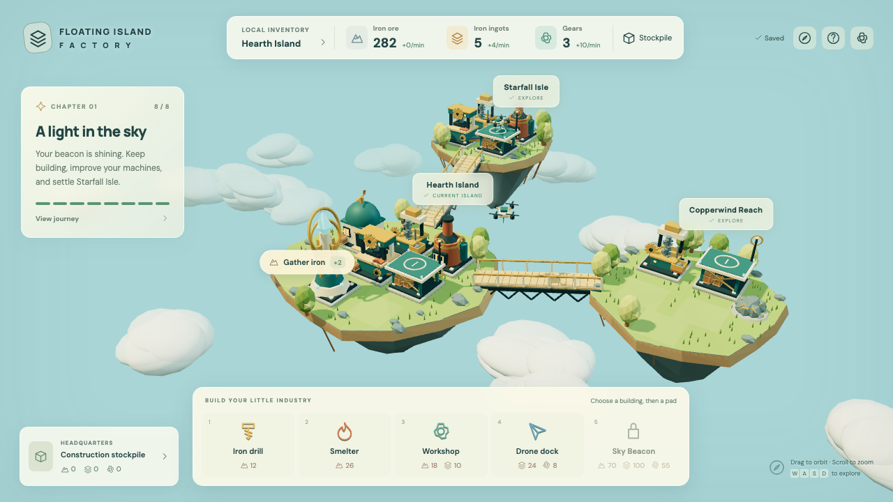

# Floating Island Factory



Turn a grassy island into a factory, then send drones carrying cargo across the clouds.

**[▶ Play in browser](https://kpetrovski.me/play/floating-island-factory/)**




## How to play

- Click **Gather iron**, then commit ore through **Stockpile** to fund your first drill.
- Add smelters and workshops, upgrade production, and unlock bridges to the other islands.
- Build a drone dock on both islands and configure a route. Bridges unlock islands; drones actually move inventory.
- **Drag** to orbit, **scroll** to zoom, **WASD/arrows** to pan, **1–5** to choose buildings, **Escape** to cancel.

Resources stay local to each island. Construction uses the shared headquarters stockpile. Progress saves in your browser; there is no offline production.

*The clip is a timelapse: waiting is sped up.*

## Development

TypeScript, Three.js, Vite.

```sh
npm install
npm run dev
```

[Development, verification, and deployment notes](DEVELOPMENT.md).
